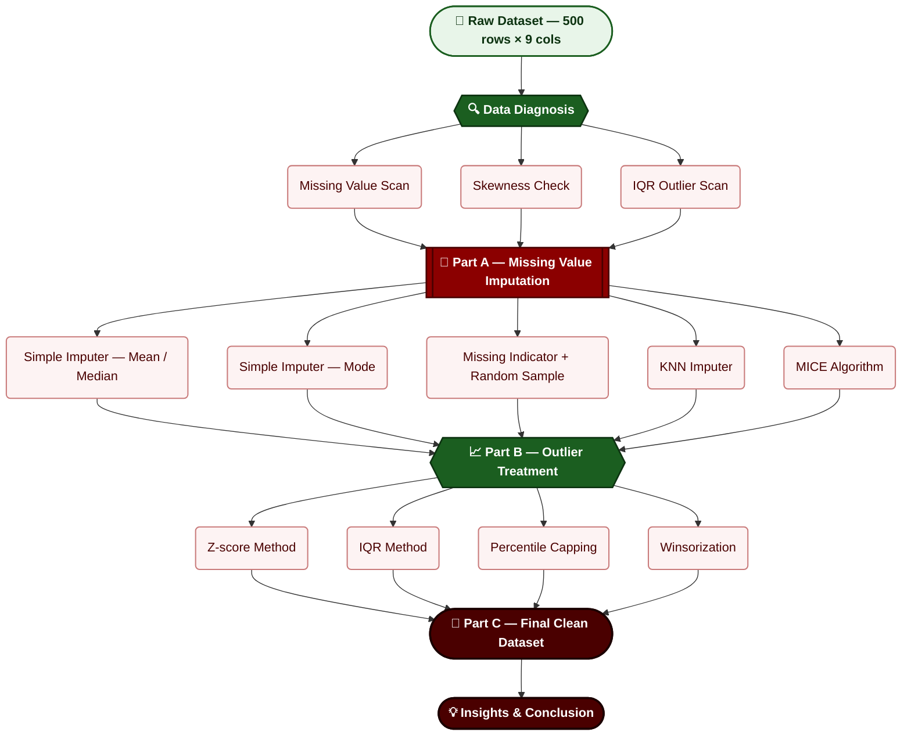

<svg width="960" height="310" viewBox="0 0 960 310" xmlns="http://www.w3.org/2000/svg">
  <defs>
    <!-- Background -->
    <linearGradient id="bg" x1="0%" y1="0%" x2="100%" y2="100%">
      <stop offset="0%" stop-color="#ffffff"/>
      <stop offset="100%" stop-color="#fcfcfc"/>
    </linearGradient>

    <!-- Title Gradient -->
    <linearGradient id="titleGrad" x1="0%" y1="0%" x2="100%" y2="0%">
      <stop offset="0%" stop-color="#d62828"/>
      <stop offset="50%" stop-color="#8b5e34"/>
      <stop offset="100%" stop-color="#2e7d32"/>
    </linearGradient>

    <!-- Pill Gradient -->
    <linearGradient id="pillGrad" x1="0%" y1="0%" x2="100%" y2="0%">
      <stop offset="0%" stop-color="#ef4444"/>
      <stop offset="35%" stop-color="#dc2626"/>
      <stop offset="55%" stop-color="#9a6a2f"/>
      <stop offset="78%" stop-color="#4d9b38"/>
      <stop offset="100%" stop-color="#22c55e"/>
    </linearGradient>

    <filter id="shadow" x="-30%" y="-30%" width="160%" height="160%">
      <feDropShadow dx="0" dy="6" stdDeviation="8"
        flood-color="#000000" flood-opacity="0.18"/>
    </filter>

    <filter id="titleShadow">
      <feDropShadow dx="0" dy="3" stdDeviation="3"
        flood-color="#000000" flood-opacity="0.15"/>
    </filter>
  </defs>

  <!-- Background -->
  <rect width="960" height="310" rx="24" fill="url(#bg)"/>

  <!-- Decorative circles -->
  <circle cx="78" cy="56" r="48" fill="#ef4444" opacity="0.10"/>
  <circle cx="882" cy="248" r="60" fill="#22c55e" opacity="0.10"/>

  <!-- Left Check -->
  <g transform="translate(30,125)">
    <circle cx="30" cy="30" r="28" fill="none" stroke="#c62828" stroke-width="5"/>
    <path d="M16 30 L28 43 L46 18"
          fill="none"
          stroke="#2e7d32"
          stroke-width="5"
          stroke-linecap="round"
          stroke-linejoin="round"/>
  </g>

  <!-- Right Graph -->
  <g transform="translate(845,118)">
    <rect width="58" height="40" rx="6"
          fill="#fafafa"
          stroke="#d5d5d5"/>
    <polyline points="10,30 22,18 34,24 44,12 50,16"
              fill="none"
              stroke="#2e7d32"
              stroke-width="3"
              stroke-linecap="round"
              stroke-linejoin="round"/>
  </g>

  <!-- Title -->
  <text x="480"
        y="105"
        text-anchor="middle"
        font-size="56"
        font-weight="800"
        font-family="Segoe UI,Arial,sans-serif"
        fill="url(#titleGrad)"
        filter="url(#titleShadow)">
      DATA CLEANSER
  </text>

  <!-- Divider -->
  <line x1="185"
        y1="126"
        x2="775"
        y2="126"
        stroke="#d8d8d8"
        stroke-width="2"/>

  <!-- Gradient Pill -->
  <rect x="180"
        y="146"
        width="600"
        height="52"
        rx="26"
        fill="url(#pillGrad)"
        filter="url(#shadow)"/>

  <!-- Pill Text -->
  <text x="480"
        y="178"
        text-anchor="middle"
        font-size="15"
        font-weight="600"
        font-family="Segoe UI,Arial,sans-serif"
        fill="#ffffff">
      Missing Value Imputation • Outlier Detection • Statistical Cleaning
  </text>

  <!-- Bottom Items -->

  <!-- Item 1 -->
  <circle cx="225" cy="235" r="12" fill="#d32f2f"/>
  <text x="225" y="239"
        text-anchor="middle"
        font-size="12"
        fill="white"
        font-family="Segoe UI">✓</text>

  <text x="248"
        y="241"
        font-size="14"
        font-family="Segoe UI"
        fill="#222">
      Data Quality
  </text>

  <!-- Item 2 -->
  <circle cx="480" cy="235" r="12" fill="#2e7d32"/>
  <text x="480" y="239"
        text-anchor="middle"
        font-size="12"
        fill="white"
        font-family="Segoe UI">🗑</text>

  <text x="503"
        y="241"
        font-size="14"
        font-family="Segoe UI"
        fill="#222">
      Machine Learning Ready
  </text>

  <!-- Item 3 -->
  <circle cx="772" cy="235" r="12" fill="#d32f2f"/>
  <text x="772" y="239"
        text-anchor="middle"
        font-size="11"
        fill="white"
        font-family="Segoe UI">★</text>

  <text x="795"
        y="241"
        font-size="14"
        font-family="Segoe UI"
        fill="#222">
      Clean Dataset
  </text>

</svg>

This project presents a **Missing Value Imputation + Outlier Treatment** analysis on a real-world **Patient Health Records** dataset containing **500 patient records**. The objective is to diagnose every data-quality issue in the dataset, apply and compare multiple statistical treatment techniques against each other, and produce a fully clean, analysis-ready dataset for disease-risk prediction.

The project combines classical statistical theory with practical implementation in Python (Jupyter Notebook), covering the complete cleaning workflow — from missing-value diagnosis and skewness-based imputation to IQR/Z-score outlier detection and non-destructive capping.

---

## 🎯 Objective


---

## 🛠️ Tools & Libraries


---

## 🗂️ Project Files

| File | Description |
|------|-------------|
| 📓 `Data_Cleanser.ipynb` | Complete missing-value imputation & outlier treatment notebook |
| 📊 `patient_health_records_dataset.csv` | Raw patient dataset — 500 records, 9 columns |
| 📄 `Part_C_Theory_Report.pdf` | Data cleaning theory, diagrams & final report (9 pages) |
| 📘 `README.md` | Project documentation (this file) |

---

## 🏗️ Project Architecture

```
Raw Dataset (500 rows × 9 cols, 250 missing cells, 62 outliers)
     │
     ▼
┌─────────────────────────────────────────────────────────┐
│  PART A — HANDLING MISSING VALUES                          │
│  Mean / Median / Mode → Random Sample → KNN → MICE          │
└─────────────────────────────────────────────────────────┘
     │
     ▼
┌─────────────────────────────────────────────────────────┐
│  PART B — HANDLING OUTLIERS                                 │
│  Z-score → IQR → Percentile Capping → Winsorization          │
└─────────────────────────────────────────────────────────┘
     │
     ▼
┌─────────────────────────────────────────────────────────┐
│  PART C — FINAL CLEAN DATASET                                │
│  0 missing · 0 outliers · 500 rows retained                   │
└─────────────────────────────────────────────────────────┘
```

---

## 📊 Dataset

| Property | Value |
|----------|-------|
| Source | `patient_health_records_dataset.csv` |
| Total records | 500 |
| Columns | 9 — `patient_id`, `age`, `gender`, `region`, `bmi`, `blood_pressure`, `cholesterol`, `glucose`, `disease_risk` |
| Missing cells (before cleaning) | 250 across 6 columns |
| Outliers detected (IQR) | 62 across `bmi`, `blood_pressure`, `cholesterol`, `glucose` |
| Target concept | `disease_risk` (0 / 1) |

### Missing Values Per Column

| Column | Missing Count | % Missing | Skewness | Strategy Chosen |
|---|---|---|---|---|
| bmi | 51 | 10.2% | 1.24 (skewed) | Median |
| age | 50 | 10.0% | 0.06 (near symmetric) | Mean |
| cholesterol | 41 | 8.2% | 2.46 (skewed) | Median |
| region | 39 | 7.8% | Categorical | Mode |
| glucose | 38 | 7.6% | 3.09 (highly skewed) | Median |
| gender | 31 | 6.2% | Categorical | Mode |
| blood_pressure | 0 | — | — | No imputation needed |

---

## 🗺️ Project Roadmap



---

# 📕 Part A — Handling Missing Values

---

## 🔍 Q1. Identify Missing Values & Summary Report

```python
missing_report = pd.DataFrame({
    "Missing Values": df.isnull().sum(),
    "Percentage (%)": round(df.isnull().mean() * 100, 2)
})
```
💡 **Insight:** `bmi` has the highest missing rate (10.2%), followed by `age` (10.0%) and `cholesterol` (8.2%) — no column exceeds ~10%, so imputation (not deletion) is the right call.

## 🛠️ Q2. Apply & Compare Imputation Techniques

**Simple Imputer (Mean / Median) — `bmi`**
```python
mean_df, median_df = df.copy(), df.copy()
mean_df["bmi"]   = SimpleImputer(strategy="mean").fit_transform(mean_df[["bmi"]])
median_df["bmi"] = SimpleImputer(strategy="median").fit_transform(median_df[["bmi"]])
```
💡 **Insight:** Mean BMI (27.09) is slightly higher than Median BMI (26.7), indicating a mild right skew. Median is the safer imputation choice since it's less sensitive to outliers.

**Simple Imputer (Mode) — `region`, `gender`**
```python
region_df["region"] = SimpleImputer(strategy="most_frequent").fit_transform(region_df[["region"]])
gender_df["gender"] = SimpleImputer(strategy="most_frequent").fit_transform(gender_df[["gender"]])
```
💡 **Insight:** "West" is the most frequent region, "Male" is the most frequent gender — both fill their missing cells completely, assuming the missingness is random (MCAR).

**Missing Indicator + Random Sample — `cholesterol`**
```python
random_df["cholesterol_missing"] = random_df["cholesterol"].isnull().astype(int)
values = random_df["cholesterol"].dropna()
mask = random_df["cholesterol"].isnull()
random_df.loc[mask, "cholesterol"] = np.random.choice(values, mask.sum())
```
💡 **Insight:** The indicator column preserves *where* data was missing, while random sampling fills gaps without flattening the original distribution's variance — unlike mean/median.

**KNN Imputer — multivariate**
```python
cols = ["age", "bmi", "blood_pressure", "cholesterol", "glucose"]
knn_df[cols] = KNNImputer(n_neighbors=5).fit_transform(knn_df[cols])
```
💡 **Insight:** KNN resolves all 5 numeric columns together using patterns from the 5 nearest similar patients — more realistic than a single global mean/median.

**MICE Algorithm — multivariate**
```python
mice_df[cols] = IterativeImputer(random_state=42).fit_transform(mice_df[cols])
```
💡 **Insight:** MICE models each incomplete column as a function of the others across several iterations — the most statistically robust imputation method tested.

## ⚖️ Comparison

```python
compare = pd.DataFrame({
    "Original": df.isnull().sum(), "Mean": mean_df.isnull().sum(),
    "Median": median_df.isnull().sum(), "Region": region_df.isnull().sum(),
    "Gender": gender_df.isnull().sum(), "Random": random_df.isnull().sum(),
    "KNN": knn_df.isnull().sum(), "MICE": mice_df.isnull().sum()
})
```
💡 **Insight:** KNN and MICE are the clear winners — they resolve missing values across `age`, `bmi`, `cholesterol`, and `glucose` **simultaneously**, unlike single-column methods.

---

# 📈 Part B — Handling Outliers

---

## 🎯 Q3. Detect & Remove Outliers

**Z-score Method — `cholesterol`, `glucose`**
```python
for col in ["cholesterol", "glucose"]:
    z = (zscore_df[col] - zscore_df[col].mean()) / zscore_df[col].std()
    zscore_df = zscore_df[z.abs() <= 3]
```
💡 **Insight:** Removed 108 rows (500 → 392, ≈21.6% dropped) — fairly aggressive, since Z-score treats each column independently and compounds row loss.

**IQR Method — `bmi`**
```python
Q1, Q3 = df["bmi"].quantile([0.25, 0.75])
IQR = Q3 - Q1
lower, upper = Q1 - 1.5 * IQR, Q3 + 1.5 * IQR
iqr_df = df[df["bmi"].between(lower, upper)]
```
💡 **Insight:** Removed 61 rows (500 → 439, ≈12.2% dropped) — more moderate than Z-score, and doesn't assume normality, so it's more robust for skewed medical data.

**Percentile Capping — `cholesterol`**
```python
lower, upper = df["cholesterol"].quantile([0.01, 0.99])
percentile_df["cholesterol"] = percentile_df["cholesterol"].clip(lower, upper)
```
💡 **Insight:** Pulls extreme values inward (max 497 → 454.25) **without deleting any rows** — mean and std barely shift, showing capping preserves sample size while taming extremes.

## ✂️ Q4. Apply Winsorization

```python
for col in ["cholesterol", "glucose"]:
    winsor_df[col] = winsorize(winsor_df[col], limits=[0.01, 0.01])
```
💡 **Insight:** Produces nearly identical statistics to percentile capping while keeping every one of the 500 rows intact — the safest outlier treatment when sample size matters.

## 🔄 Q5. Compare Dataset Shape & Summary — Before vs After

```python
comparison = pd.concat(
    [Original_df.describe(), iqr_df.describe()],
    axis=1, keys=["Before", "After"]
)
```
💡 **Insight:** Outlier *removal* (IQR) shrinks the dataset by 12.2% and tightens spread, confirming the core trade-off: removal boosts stability but costs data volume, while capping/winsorization achieves stability with **zero data loss**.

---

# 🏁 Part C — Final Clean Dataset

---

## ✅ Q6. Present Final Cleaned Dataset

```python
print("Final Cleaned Dataset — Shape:", df.shape)
display(df.head())
df.describe()
```

| Metric | Before | After |
|---|---|---|
| Total records | 500 | 500 (0 dropped) |
| Missing cells | 250 | 0 |
| Outliers (IQR-flagged) | 62 | 0 |

💡 **Final approach:** skewness-based imputation (Mean for symmetric `age`, Median for skewed `bmi`/`cholesterol`/`glucose`, Mode for categorical `gender`/`region`) combined with IQR-based capping (Winsorization) for outliers.

---

## 📋 Brief Report Summary

- **Best imputation strategy:** Median for skewed numeric columns, Mean for the near-symmetric `age` column, Mode for categorical columns — validated further by KNN/MICE as the most robust multivariate options.
- **Best outlier strategy:** IQR-based capping (Winsorization) over outright removal — removal would have discarded 62 records (12.4%), many of which represent genuinely high-risk patients relevant to `disease_risk` prediction.
- **Outcome:** A complete, stable, analysis-ready dataset of 500 records with 0 missing values and 0 extreme outliers.

---

## 🚀 How to Run

```bash
# 1. Install dependencies
pip install pandas numpy scikit-learn scipy jupyter

# 2. Launch Jupyter
jupyter notebook

# 3. Open and run
Data_Cleanser.ipynb
```

---

## ✅ Project Checklist

- [x] Load dataset & inspect structure
- [x] Identify missing values (summary report with percentages)
- [x] Simple Imputer — Mean / Median (BMI)
- [x] Simple Imputer — Most Frequent (Region, Gender)
- [x] Missing Indicator + Random Sample Imputation (Cholesterol)
- [x] KNN Imputer (multivariate)
- [x] MICE Algorithm (multivariate)
- [x] Compare all imputation methods
- [x] Detect outliers — Z-score method
- [x] Detect outliers — IQR method
- [x] Percentile capping (1st–99th)
- [x] Winsorization
- [x] Compare dataset shape & summary before/after outlier treatment
- [x] Present final cleaned dataset
- [x] Notebook Included
- [x] Dataset Included

---

## 👩‍💻 Author

**Priya Savaliya**
📍 Ahmedabad, Gujarat, India

*"Data-Driven Decisions · Statistical Thinking · Evidence-Based Conclusions"*

⭐ If you found this project helpful, give it a star and feel free to fork!
